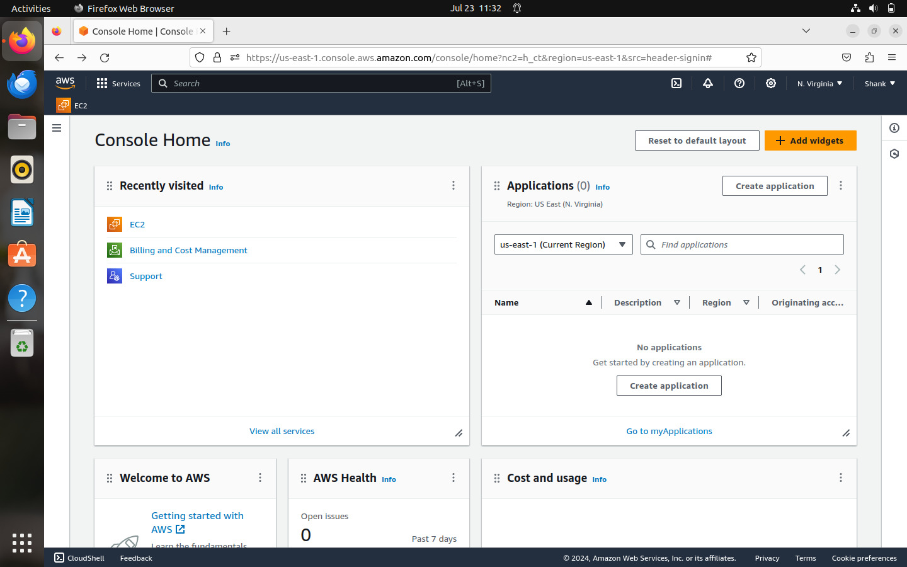
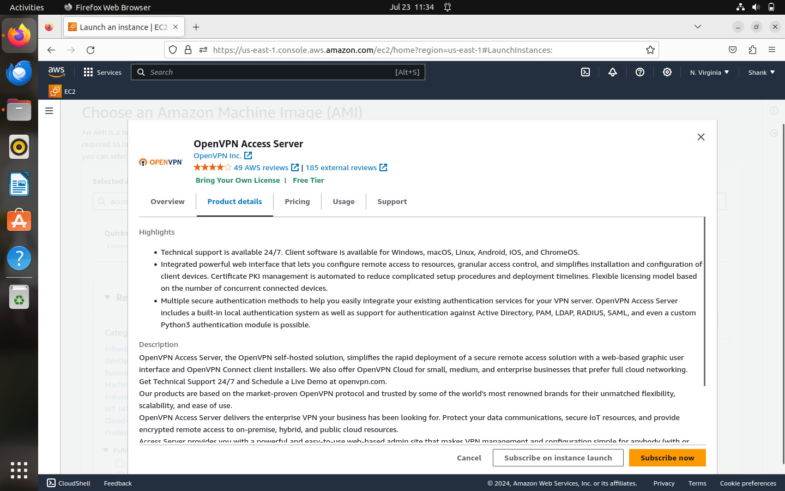
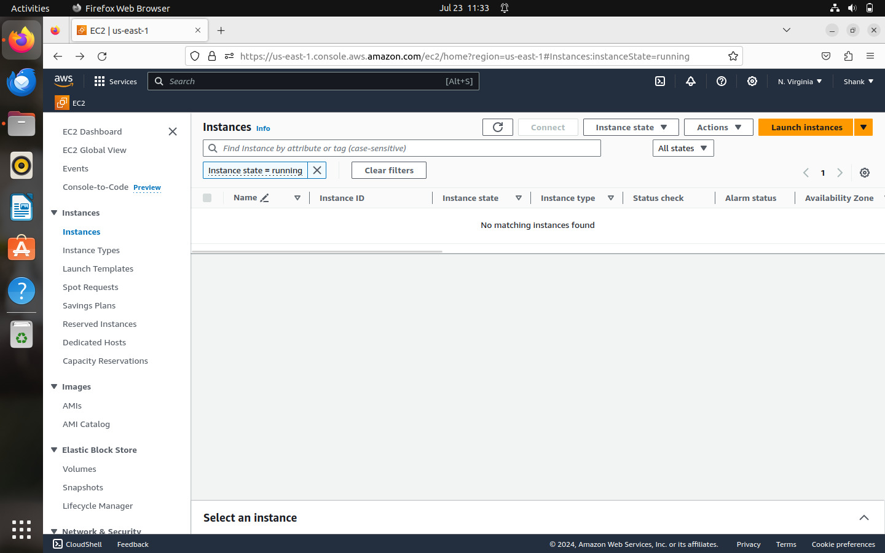
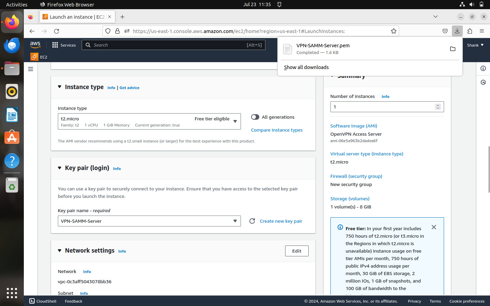
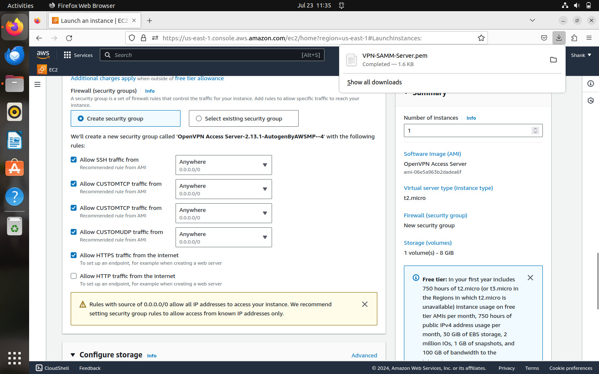
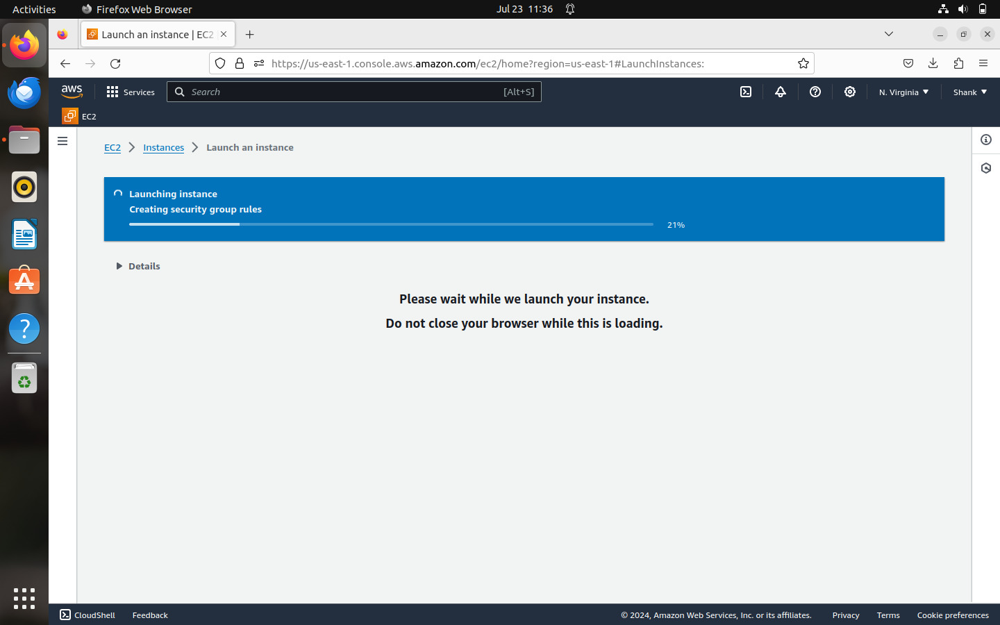
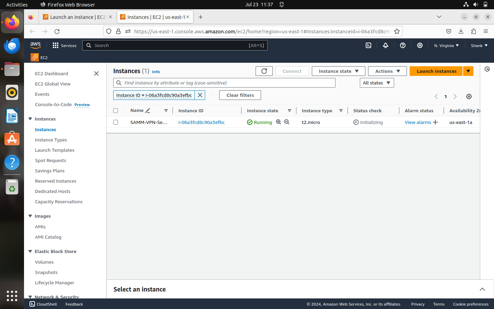
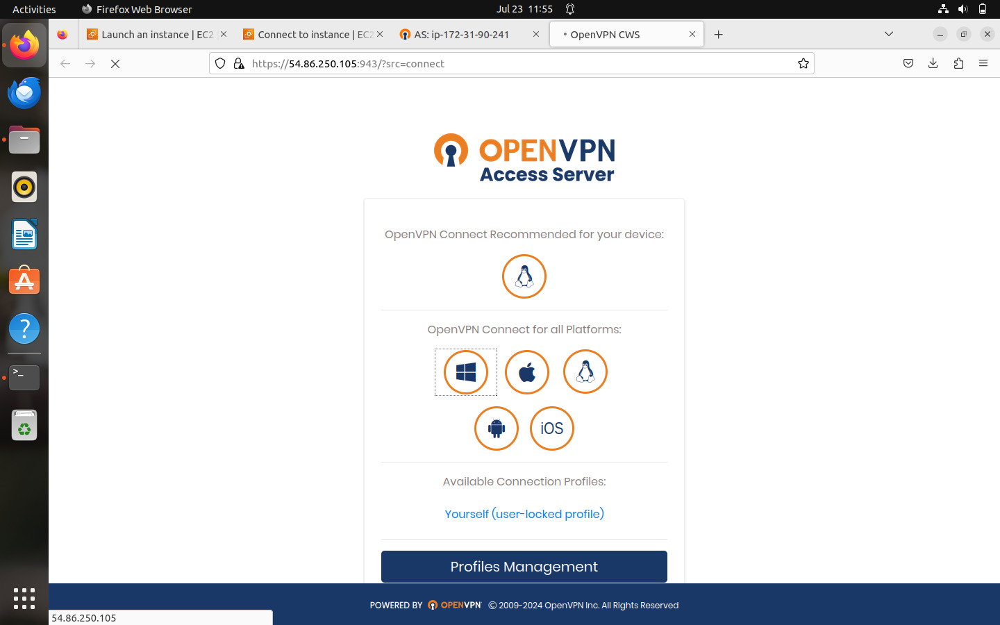
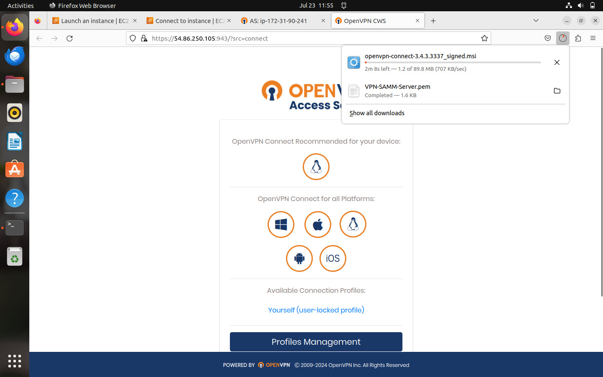
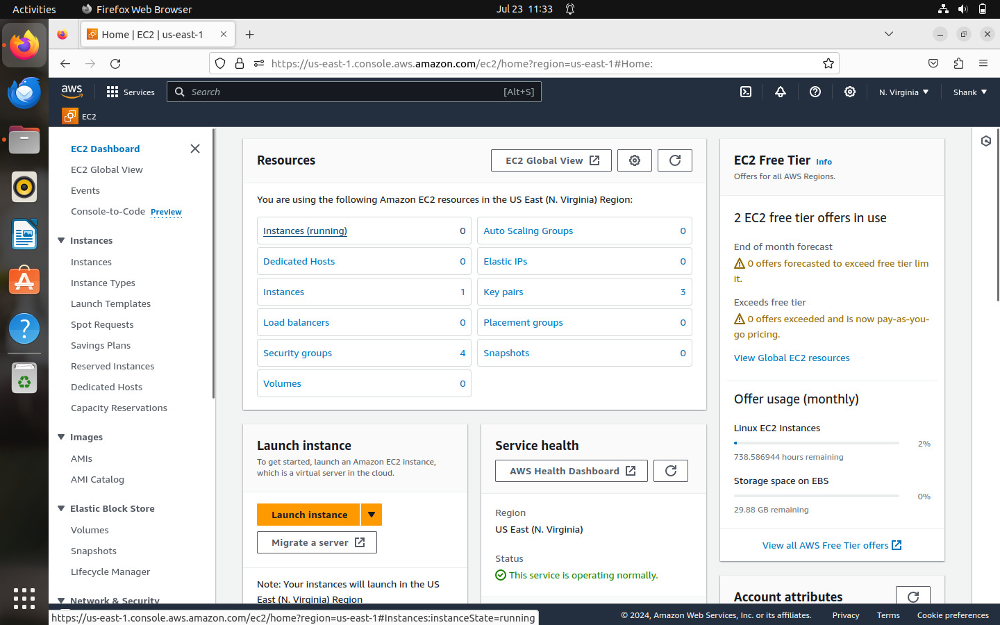

# Shank_Custom_VPN
Your Own Custom  free VPN setup
# 🚀 Deploy OpenVPN Access Server on AWS EC2


---

## 📌 Project Overview

This project sets up a *secure VPN server on AWS EC2* using *OpenVPN Access Server*. It allows you to connect any device to the cloud and route all traffic through the VPN, enhancing security and enabling region-based browsing.

---

## 🧰 Tech Stack

- ☁ Amazon Web Services (AWS)
- 🐧 Ubuntu EC2 Instance
- 🔐 OpenVPN Access Server
- 📦 SSH for remote access
- 🔒 SSL for secure web admin

---

## 📸 Project Snapshots

### 🟠 Screenshot of the AWS Console homepage displaying general navigation and service options


---

### 🔑 AWS Marketplace listing for "OpenVPN Access Server" with detailed product features and licensing info


---

### 🛡️  EC2 dashboard showing no running instances in the selected AWS region.


---

### 📥 EC2 instance launch configuration page showing AMI, key pair, instance type, and network settings.


---

### ✅ Security group rules setup for a new EC2 instance with OpenVPN-related firewall settings.



---

### AWS console message indicating that an EC2 instance is being launched and setup is in progress.



---

###  EC2 instance list showing a running instance named "SAMM-VPN-Server" with its current state.



---

### OpenVPN Access Server web interface showing available connection profiles and client installers..



---

### OpenVPN web UI during download of the OpenVPN Connect installer and PEM file.



---

### Overview of EC2 resources usage and Free Tier status on the AWS EC2 dashboard.



---

## ⚙ Step-by-Step Setup

### 🔸 1. Launch EC2 via AWS Marketplace

1. Search for *OpenVPN Access Server* in AWS Marketplace
2. Click *Continue to Subscribe* and then *Launch through EC2*
3. Choose:
   - Instance type: t2.medium (or t2.micro for test)
   - Key pair: Create or select .pem key
   - Security group: Open ports 22 (SSH), 943, 443

### 🔸 2. Connect to EC2 via SSH

```bash
# Move your downloaded key to a secure location
mv ~/Downloads/openvpn-key.pem ~/.ssh/

# Set correct permissions
chmod 400 ~/.ssh/openvpn-key.pem

# Connect to your EC2 instance
ssh -i ~/.ssh/openvpn-key.pem openvpn@<ec2-public-ip>
